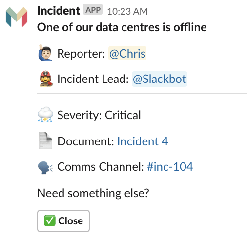

[](https://pypi.org/project/django-incident-response/)
[](https://docs.python.org/3/)
[](https://docs.djangoproject.com/en/2.2/)
[](https://travis-ci.org/monzo/response)
[](https://choosealicense.com/licenses/mit/)

# Response ⚡

Dealing with incidents can be stressful. On top of dealing with the issue at hand, responders are often responsible for handling comms, coordinating the efforts of other engineers, and reporting what happened after the fact.  Monzo built Response to help reduce the pressure and cognitive burden on engineers during an incident, and to make it easy to create information rich reports for others to learn from.

<p align="center">
  <br />
  <em>The headline post when an incident is declared</em>
</p>

If you're interested in how we use this tool at Monzo, there's an overview in [this video](https://twitter.com/evnsio/status/1116026261401247745).

---

# Try it out

Response is a Django app which you can include in your project.  If you're just looking to give it a try, follow the instuctions for the [demo app](demo/README.md)!

---

# Adding Response to your own project

[Start a new Django project](https://docs.djangoproject.com/en/2.2/intro/tutorial01/), if you don't have one already:
```
$ django-admin startproject myincidentresponse
```

Install response:
```
$ pip install django-incident-response
```

In `settings.py`, add these lines to `INSTALLED_APPS`:
```python
INSTALLED_APPS = [
    ...
    "after_response",
    "rest_framework",
    "bootstrap4",
    "response.apps.ResponseConfig",
]
```

Add the following to `settings.py`:

```python
USE_TZ = False # if this exists elsewhere in your settings.py, just update the value

STATIC_ROOT = "static"

# Django Rest Framework
REST_FRAMEWORK = {
    "PAGE_SIZE": 100,
    "DEFAULT_PAGINATION_CLASS": "rest_framework.pagination.LimitOffsetPagination",
    "DEFAULT_PERMISSION_CLASSES": [
        "rest_framework.permissions.IsAuthenticated",
    ],
}
#

# Markdown Filter
MARKDOWN_FILTER_WHITELIST_TAGS = [
    "a", "p", "code", "h1", "h2", "ul", "li", "strong", "em", "img",
]

MARKDOWN_FILTER_WHITELIST_ATTRIBUTES = ["src", "style"]

MARKDOWN_FILTER_WHITELIST_STYLES = [
    "width", "height", "border-color", "background-color", "white-space",
    "vertical-align", "text-align", "border-style", "border-width", "float",
    "margin", "margin-bottom", "margin-left", "margin-right", "margin-top",
]

RESPONSE_LOGIN_REQUIRED = True
```

In `urls.py`, add the following to `urlpatterns` (you may also need to import `include`):
```python
urlpatterns = [
    ...
    path('slack/', include('response.slack.urls')),
    path('core/', include('response.core.urls')),
    path('', include('response.ui.urls')),
]
```

---

# Completing the setup and config with Slack

## 1. Create a Slack App

Follow [these instructions](./docs/slack_app_create.md) to create a new Slack App.

## 2. Update your `settings.py`

| Environment Variable  | Descriptions |
|---|---|
| `SLACK_TOKEN`  | Response needs an OAuth access token to use the Slack API.<br /><br />Copy the Bot Token that starts `xoxb-...` from the OAuth & Permissions section of your Slack App and use it to set the `SLACK_TOKEN` variable.|
| `SITE_URL`  | Response needs to know where it is running in order to create links to the UI in Slack.  Whilst running locally, you might want this set to something like `http://localhost:8000`. |
| `SLACK_SIGNING_SECRET`  | Response uses the Slack signing secret to restrict access to public endpoints.<br /><br />Copy the Signing secret from the Basic Information page and use it to set the `SIGNING SECRET` variable. |
| `INCIDENT_CHANNEL_ID`  | When an incident is declared, a 'headline' post is sent to a central channel.<br /><br />See the [demo app settings](./demo/demo/settings/dev.py) for an example of how to get the incident channel ID from the Slack API. |
| `INCIDENT_BOT_ID`  | We want to invite the Bot to all Incident Channels, so need to know its ID.<br /><br />See the [demo app settings](./demo/demo/settings/dev.py) for an example of how to get the bot ID from the Slack API. |
| `SLACK_CLIENT`  | Response needs a shared global instance of a Slack Client to talk to the Slack API. Typically this does not require any additional configuration. <br /><pre>from response.slack.client import SlackClient<br />SLACK_CLIENT = SlackClient(SLACK_TOKEN)</pre> |

## 3. Running the server

Before you can complete the Slack app setup, you need to have the app running somewhere that's accesible to to the internet.  That means either deploying your Django project somewhere (see [here](https://lmgtfy.com/?q=deploy+django+app&s=) or running it locally and exposing with something like [ngrok](https://ngrok.com/).

For simplicity, we'll assume you're developing using ngrok.

First make sure your DB is fully migrated and up-to-date:
```
python3 manage.py migrate
```

Next, run the Django development server:
```
python3 manage.py runserver 0.0.0.0:8000
```

Finally, run ngrok:
```
ngrok http 8000
```

Make note of the ngrok url as you'll need it in the following section as the `public-url`.

## 4. Complete the Slack App Setup

Head back to the Slack web UI and complete the configuration of your app, as [described here](./docs/slack_app_config.md).

## 5. Test it's working!

In Slack, start an incident with `/incident Something's happened`.  You should see a post in your incidents channel!

- Visit the incident doc by clicking the Doc link.
- Create a comms channel by clicking the button.
- In the comms channel check out the `@incident` commands.  You can find the ones available by entering `@incident help`.
