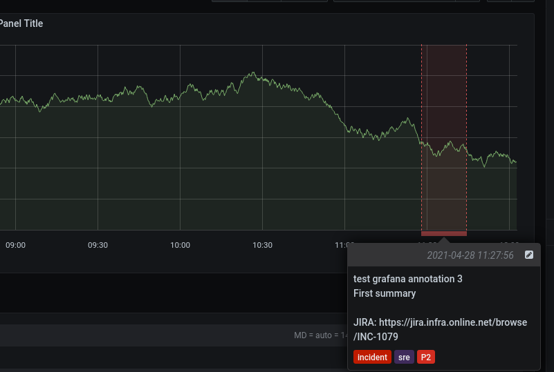
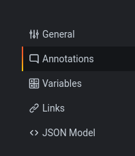
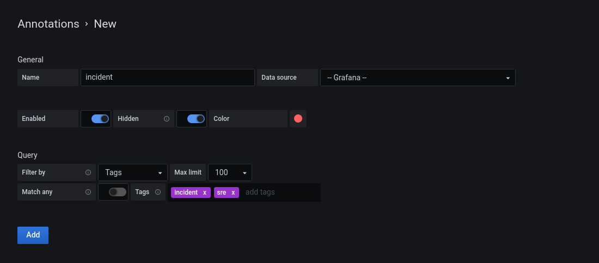

# Grafana annotation support

  

## Respone configuration
To add an incident annotation on your diagrams (see exemple above), please set the following variables:

* `GRAFANA_URL`: The URL of your grafana instance (ex: https://grafana.example.net);
* `GRAFANA_TOKEN`: A Grafana API key with Editor role.

## Grafana configuration

Edit your dashboard settings.

Go to the "Annotations" section:

Then add a new annotation with the following settings:

* Name: Incident (for example)
* Data source: -- Grafana --
* Color: Enabled :heavy_check_mark: (OPTIONAL)
* Filter by: Tags
* Tags:
  * incident

