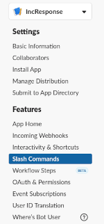

# Configuring your Slack app

The steps here outline how to complete the Slack side setup for Response.  The app will need to be running, and accessible on a public domain to complete these steps as Slack validates the URL before it'll accept the change.

## Slash Command

- In the Slash commands page on your app (something like: https://api.slack.com/apps/%YOUR-APP-ID%/slash-commands), click `Create New Command`.

 

- Enter the following info:
  - Command:  `/incident`
  - Request URL: `https://<public-url>/slack/slash_command`
  - Short Description: `Trigger an incident`
  - Usage Hint: `What's the problem?`

## Event Subscriptions

**Important** You need to have the server running and available to setup events, as Slack sends a challenge request to this address and expects a specific response.

In the Event Subscriptions page we need to configure the following:

- Toggle `Enable Events` to On
- In the Request URL enter: `https://<public-url>/slack/event`

- Under the Subscribe to Bot Events section, add the following:
  - `app_mention`
  - `pin_added`
  - `pin_removed`
  - `message.channels`
  - `channel_rename`

## Configure interactive components

- In the Interactive Components page, enable and set the URL to `https://<public-url>/slack/action`.

## Reinstall App

With these changes made, you'll need to reinstall the app to your workspace. There should be a bar at the top with a link, but if not you can find the resinstall link in the OAuth & Permissions page.