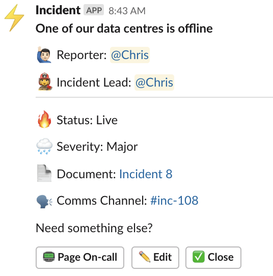
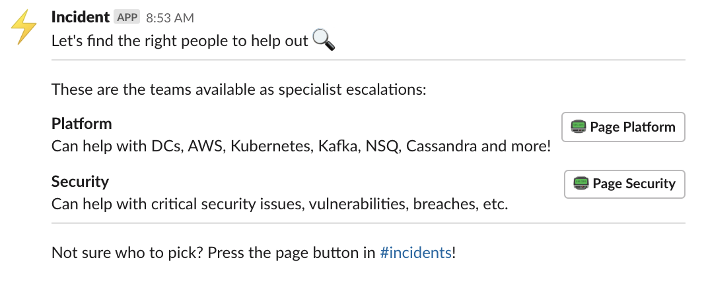

# Configuring PagerDuty

If you use PagerDuty, you can enable it within Response by setting a handful of environment variables 🙌

## Assumptions

There are a zillion different ways to setup PagerDuty and your on-call rotations.  The default implementation in Respone ⚡ assumes the following.

- You want create all your incidents on the same [PagerDuty Service](https://support.pagerduty.com/docs/services-and-integrations).

- You have a primary on-call function associated with that service.  There'll be a button added to the Headline Post in Slack, and clicking that will send a high urgency notification to them.

- You have a number of other teams that you might want to escalate to during an incident.  Each of these will be configured as their own [PagerDuty Escalation Policy](https://support.pagerduty.com/docs/escalation-policies).  Escalations to these people will be possible by running `@incident escalate` within an incident Comms Channel.

## Setup

The following environment variables need to present for the PagerDuty implemetation to work.  In the development setup, this means adding them to the `.env` file that's mounted by Docker Compose.

- `PAGERDUTY_ENABLED`  
  Set this to `True` to turn on the integration.

- `PAGERDUTY_SERVICE`  
  This is the ID of PagerDuty Service that where incidents will be raised.  You can find it through the PagerDuty web interface by navigating to the service and pulling it out of the address.  As an example, if you URL is `https://monzo.pagerduty.com/services/ABCDEFG`, this environment variable should be set to `ABCDEFG`.

- `PAGERDUTY_API_KEY`  
  This should be a PagerDuty V2 API Key.  Instructions for getting one can be found [here](https://support.pagerduty.com/docs/using-the-api).

- `PAGERDUTY_EMAIL`  
  Many of the PagerDuty API actions require the email address of the 'user' who is performing the action. This email must be associated with a user on your account who has permission to create incidents.  For clarity, it may be worth creating a dummy user for Response ⚡ so it's clear when actions were made by the bot.

With the environment variables set, the `📟 Page On-caller` button will appear on the Headline Post.  Give it a press!

   
  <em>The headline post when PagerDuty is configured</em>

## Configuring Escalations

If you want to allow people to escalate to other teams during an incident, you can add them throug the [Django Admin Interface](http://127.0.0.1:8000/admin).  In the development instance the user and password are both set to `admin`.

Under PagerDuty > Escalations, select `Add`.  Each escalation requires the following:

- **Name**:  The name that will be shown in Slack for this escalation, e.g. "Platform Team".
- **Summary**:  A brief overview of the team, which is displayed in Slack and used to help people escalate to the right place, e.g. "Can help with AWS, Kubernetes, Data centres, Cassandra"
- **Escalation Policy**:  The Escalation Policy ID from PagerDuty.  Can be found in the PagerDuty UI by visiting the relevant escalation policy and pulling from the URL.  For example if you escalation policy URL is `https://monzo.pagerduty.com/escalation_policies/#EFGHIJK`, your ID will be `EFGHIJK`.

Once you have some escalations configured, you'll be able to reach them with `@incident escalate`.

   
  <em>Escalating to other teams</em>

